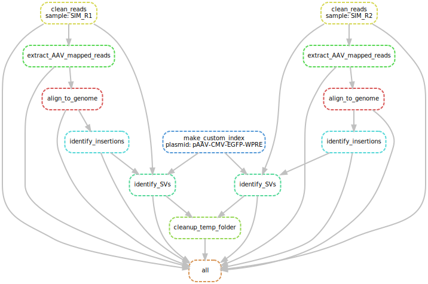

# Test folder
This folder contains a small simulated dataset for testing the TES pipeline.
The test should be self-contained with a tiny genome and corresponding minimap2 index already pre-made and inside this folder.
Ssee `make_test_data.sh` for details on generation of the data.


## Run the test
While standing in this directory run the following:
```
snakemake all --rerun-incomplete --keep-going --keep-incomplete --printshellcmds --jobs 4 --snakefile ../workflow/Snakefile.smk --configfile TES_test_config.yaml
```
The run should take ~10s and generate a folder (`TES_output`) which contains all the output.


## Make DAG
A graphical overview of the steps in the pipeline can be generated by plotting the directed acyclic graph:
```
snakemake --dag all --snakefile ../workflow/Snakefile.smk --configfile TES_test_config.yaml | dot -Tsvg > test_dag.svg
```




