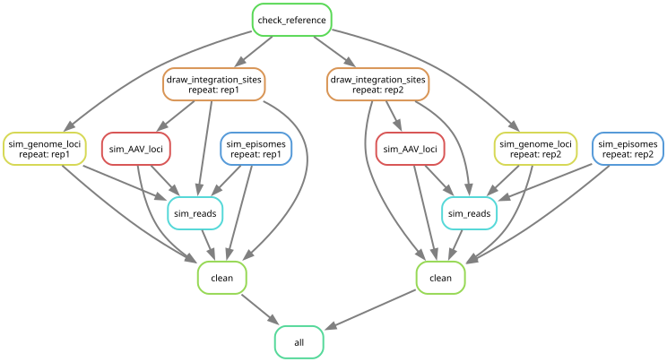

# PacBio Read Simulation Workflow for Target Enrichment AAV Integration Analysis
This Snakemake workflow simulates PacBio reads from target-enriched AAV integration events.
It supports various parameters to mimic variance in real data to enable benchmarking of AAV integration detection pipelines.

## High-Level Overview
The pipeline constructs three classes of fragments: (1) genomic fragments with simulated AAV integrations, (2) episomal AAV DNA fragments, and (3) background genomic fragments without integrations.
For integration events, AAV fragments are inserted into randomly drawn genomic loci with optional deletions, insertions, and translocations at junction sites.
For episomal DNA, AAV fragments are simulated without genomic integration.
All fragments are subjected to a simulated target-enrichment pulldown to reflect realistic fragment recovery biases, then used as input to a long-read simulator (Badread).
The resulting reads can be fed into AAV integration detection and analysis pipelines.

## Processing Steps (Snakemake pipeline)

The following describes the steps (rules) implemented in the main Snakemake file: `workflow/Snakefile.smk`

1. **Reference validation (`check_reference`)**  
   - **Script**: `ref_length.py`
   - **Purpose**: Validates that the reference genome meets minimum length requirements for all chromosomes
   - **Requirements**: Each chromosome must be at least 11× max read length + 2× max deletion size
   - **Outputs**: 
     - Empty file `reference_check` (non-empty indicates validation failure)
     - `chromosome_lengths.tsv` containing chromosome names and lengths for weighted sampling

2. **Draw genomic integration sites (`draw_integration_sites`)**  
   - **Script**: `sample_breakpoints.py`
   - **Tools**: `bedtools getfasta`, `vsearch`
   - **Purpose**: Sample genomic loci that will serve as AAV integration targets
   - **Process**:
     1. Sample 2× the requested number of breakpoints (to support translocations requiring two fragments)
     2. Optional: Use weighted sampling from BED probability file (`sampling_prob_bed`) to bias the selection of integration sites e.g. to prefer open chromatin regions
     3. Expand each breakpoint to a fragment of length 10× max read length + 2× max deletion size
     4. Extract sequences using `bedtools getfasta`
     5. Shuffle fragments with `vsearch` to randomize order
     6. Compress and output integration site fragments
   - **Output**: `{repeat}_integration_sites.fa.gz`

3. **Integrate AAV into genome fragments and simulate pulldown (`sim_AAV_loci`)**  
   - **Script**: `add_integration.py`
   - **Dependencies**: `AAVFragmentGenerator`, `DeletionGenerator`, `InsertionGenerator`
   - **Tools**: `minimap2`, `target_enrichment.py`
   - **Purpose**: Insert AAV fragments into genomic loci and simulate junction indels and translocations
   - **Process**:
     1. For each integration site:
        - Generate an AAV fragment using the configured method (gamma_stick or gamma_biased_stick)
        - Optional: Use weighted AAV genome breakpoint sampling from BED file (`aav.prob_file`) to bias the generation of AAV fragments e.g. to prefer certain AAV fragmentation like ITR to ITR fragments
        - Randomly orient AAV fragment (forward or reverse complement)
        - Add insertion sequences at both junctions
        - Create genomic deletion at integration site
        - Generate translocation events (join two separate genomic fragments)
        - Expand each event by configured multiplicity (`expansion`) to simulate multiple copies of the same integration e.g. from clonally expanded cells
        - Fragment the integrated sequence to the target size distribution (simulated DNA shearing)
     2. Align fragments to target enrichment panel using `minimap2`
     3. Using the primary alignment from minimap2, simulate target enrichment i.e. pulldown with `target_enrichment.py`:
        - Apply enrichment model (e.g., "twist" for Twist Bioscience hybrid capture)
        - Amplify enriched fragments (`amplification` parameter) to simulate pre-pulldown PCR amplification
        - Include leakage of non-enriched fragments (`leakage` parameter) to simulate carryover DNA fragments i.e. DNA that did not get washed away during pulldown
   - **Outputs**: 
     - `{repeat}_integration_events.tsv`: Metadata table with integration coordinates, AAV breakpoints, orientations, junctions (described below)
     - `{repeat}_integration_loci.fa.gz`: Output fragments containing AAV integrations

4. **Simulate background genome loci (`sim_genome_loci`)**  
   - **Script**: `fragment_resizing.py`
   - **Tools**: `wgsim`, `minimap2`, `target_enrichment.py`
   - **Purpose**: Generate background genomic fragments without AAV integration
   - **Process**:
     1. Use `wgsim` to sample uniform-length fragments from the genome
     2. Resize fragments using `fragment_resizing.py` to follow the same gamma distribution as the AAV integration fragments
     3. Align to target enrichment panel with `minimap2` (same parameters as AAV loci)
     4. Apply enrichment simulation (no amplification, only leakage)
   - **Output**: `{repeat}_genome_loci.fa.gz`

5. **Simulate episomal AAV DNA (`sim_episomes`)**  
   - **Script**: `generate_episomes.py`
   - **Dependencies**: `AAVFragmentGenerator`
   - **Tools**: `minimap2`, `target_enrichment.py`
   - **Purpose**: Simulate episomal AAV DNA fragments
   - **Process**:
     1. Generate AAV fragments using same method as integrations
     2. Randomly orient each fragment (forward or reverse complement)
     3. Align to target enrichment panel with `minimap2`
     4. Apply enrichment simulation (no amplification, only leakage)
   - **Output**: `{repeat}_episome_loci.fa.gz`

6. **Combine and shuffle loci + simulate reads (`sim_reads`)**  
   - **Tool**: `badread`
   - **Purpose**: Merge all fragment types and simulate PacBio-style reads
   - **Process**:
     1. Concatenate enriched loci from three sources:
        - Integration loci (AAV-containing)
        - Genome loci (background)
        - Episome loci (episomal AAV)
     2. Shuffle merged loci with `vsearch` to eliminate positional bias
     3. Compress shuffled loci (serves as a reference)
     4. Run `badread simulate` with user-specified parameters:
        - Coverage model (depth per locus)
        - Identity distribution (mean, stdev)
        - Error model (e.g., pacbio2021)
        - Quality score model
        - Adapter sequences and identity
        - Chimera, glitch, junk, and random read rates
   - **Outputs**: 
     - `{repeat}_simulated_reads.fastq.gz`: Final synthetic PacBio reads
     - `{repeat}_all_loci.fa.gz`: Combined reference loci

7. **Cleanup (`clean`)**  
   - **Purpose**: Manage intermediate files based on configuration
   - **Behavior**:
     - If `keep_intermediate=True`: Retain all files, create completion marker
     - If `keep_intermediate=False`: Remove intermediate loci files (integration_sites, integration_loci, genome_loci, episome_loci, all_loci), keep only final reads and completion marker
   - **Output**: `{repeat}_simulation_done`

8. **Aggregation (`all`)**  
   - **Purpose**: Top-level rule collecting all per-repeat completion markers

## Configuration Parameters
Key tunable parameters are defined in `config/default_config.yaml` (can be overriden via a custom config file). See detailed parameter tables at the end of this document.

**Key Parameter Categories:**
- **Input Files**: Reference genome, AAV genome, target enrichment panel
- **Integration Settings**: Number of events, AAV fragment generation method, deletions, insertions, translocations
- **Read Simulation**: Fragment length distribution, coverage, genome and episomal read counts
- **Target Enrichment**: Enrichment model, amplification, leakage, minimum complementarity length
- **Read Quality**: Badread parameters for error models, adapters, chimeras, quality scores
- **Reproducibility**: Random seed for deterministic simulations

### Reproducibility

The pipeline supports fully reproducible simulations through the `seed` parameter:

**Setting the Seed:**
```yaml
seed: 42  # Set to any integer for reproducible results, or null for random
```

**Behavior:**
- When `seed` is set to an integer (e.g., `42`), all random number generation becomes deterministic
- Running the pipeline multiple times with the same seed produces identical results
- Each replicate (`rep1`, `rep2`, etc.) automatically receives a unique but deterministic seed:
  - `rep1` uses `seed + 1`
  - `rep2` uses `seed + 2`
  - And so on...
- When `seed: null`, random behavior varies between runs

**What is seeded:**
- Python random number generators (`random`, `numpy.random`)
- External tools: `wgsim` (-S), `vsearch` (--randseed), `minimap2` (--seed), `badread` (--seed)
- Python hash ordering (PYTHONHASHSEED=0)

**Example:**
With `seed: 42` and `repeats: 2`:
- First run produces `rep1` (seed=43) and `rep2` (seed=44)
- Second run produces identical `rep1` and `rep2` results
- Changing seed to `100` produces different but reproducible results


## Installation and Dependencies

### Python Dependencies
Install required Python packages using pip:

```bash
pip install -r requirements.txt
```

**Required packages:**
- `numpy>=1.21.0` - Numerical computing
- `scipy>=1.7.0` - Scientific computing and statistics
- `biopython>=1.79` - Biological sequence manipulation
- `matplotlib>=3.4.0` - Plotting (optional, for KDE visualization)
- `snakemake>=8.0` - Workflow management
- `pytest>=7.0.0` - Testing framework

### External Tools
The following command-line tools must be installed and available in your PATH:

| Tool | Purpose | Used In | Repository | Version (SHA) |
|------|---------|---------|------------|---------------|
| `wgsim` | Raw fragment sampling from reference genome | `sim_genome_loci` | [lh3/wgsim](https://github.com/lh3/wgsim) | `a12da33` |
| `bedtools` | Extract genomic sequences by coordinates | `draw_integration_sites` | [arq5x/bedtools2](https://github.com/arq5x/bedtools2) | `705ccfd` |
| `vsearch` | Shuffling and sequence manipulation | `draw_integration_sites`, `sim_reads` | [torognes/vsearch](https://github.com/torognes/vsearch) | `d98284e` |
| `minimap2` | Alignment to target enrichment panel | `sim_AAV_loci`, `sim_genome_loci`, `sim_episomes` | [lh3/minimap2](https://github.com/lh3/minimap2) | `8170693` |
| `badread` | Long-read sequencing simulation | `sim_reads` | [rrwick/Badread](https://github.com/rrwick/Badread) | `f38ef6f` |
| `gzip` | Compression of intermediate and final products | All rules | - | - |


### Custom Python Scripts
| Script | Purpose | Used In |
|--------|---------|---------|
| `ref_length.py` | Validate reference genome chromosome lengths | `check_reference` |
| `sample_breakpoints.py` | Sample genomic breakpoints with optional weighted probabilities | `draw_integration_sites` |
| `add_integration.py` | Insert AAV into genomic loci with deletions/insertions/translocations | `sim_AAV_loci` |
| `fragment_resizing.py` | Resize fragments to gamma distribution | `sim_genome_loci` |
| `generate_episomes.py` | Generate episomal AAV DNA fragments | `sim_episomes` |
| `target_enrichment.py` | Simulate target enrichment and amplification | `sim_AAV_loci`, `sim_genome_loci`, `sim_episomes` |
| `aav_fragment_generator.py` | AAV fragment generation with multiple methods | Used by `add_integration.py`, `generate_episomes.py` |
| `indel_generator.py` | Generate deletions and insertions at junctions | Used by `add_integration.py` |
| `pulldown_probability.py` | Calculate enrichment probabilities from alignments | Used by `target_enrichment.py` |
| `bed_validator.py` | Validate BED probability files for overlaps and format | Config validation |
| `badread_dependencies.py` | Fragment length distribution utilities | Used by `add_integration.py`, `fragment_resizing.py` |


### Verification
Verify installation by running the test suite:

```bash
python workflow/scripts/run_tests.py
```


## Outputs

### Final Outputs (Always Generated)
For each repeat (`repX`):
- **`{repeat}_simulated_reads.fastq.gz`**: Final synthetic PacBio-style reads with errors, adapters, and quality scores
- **`{repeat}_integration_events.tsv`**: Metadata table of simulated integration events (coordinates, AAV breakpoints, orientations, junction details)
- **`{repeat}_simulation_done`**: Completion marker indicating successful run

**Shared outputs:**
- **`reference_check`**: Empty file indicating reference validation passed
- **`chromosome_lengths.tsv`**: Tab-separated file with chromosome names and lengths for weighted sampling
- **`config.json`**: Complete configuration used for the run (stored in run folder)

### Intermediate Outputs (Retained only if `keep_intermediate: True`)
For each repeat (`repX`):
- **`{repeat}_integration_sites.fa.gz`** *(intermediate)*: Candidate genomic loci sampled for AAV integration (pre-integration FASTA sequences)
- **`{repeat}_integration_loci.fa.gz`** *(intermediate)*: Target-enriched fragments containing AAV integrations (FASTA format)
- **`{repeat}_genome_loci.fa.gz`** *(intermediate)*: Target-enriched background genomic fragments without AAV integration (FASTA format)
- **`{repeat}_episome_loci.fa.gz`** *(intermediate)*: Target-enriched episomal AAV DNA fragments (FASTA format)
- **`{repeat}_all_loci.fa.gz`** *(intermediate)*: Combined and shuffled loci from all three sources, used as reference for read simulation (FASTA format)

## Output File Formats

### FASTQ Files

#### `{repeat}_simulated_reads.fastq.gz`
Standard FASTQ format generated by Badread with PacBio-style errors and quality scores.

**Header format (from Badread):**
```
@<read_id> <source_seq_header>,<strand>,<start>-<end> length=<length> error-free_length=<ef_length> read_identity=<identity>%
```
- `read_id`: Unique UUID generated by Badread
- `source_seq_header`: Original FASTA header from input loci (integration/episome/genome)
- `strand`: `+strand` or `-strand`
- `start-end`: Coordinates within source sequence (1-based)
- `length`: Simulated read length (with errors)
- `error-free_length`: Original fragment length
- `read_identity`: Percentage sequence identity after errors

Example:
```
@a7f97ba3-8a57-45b7-7da1-27f90810c932 chr1-4083869-fwd_chr1-4083870-fwd_AAVint_5_1_M_amp8,+strand,0-8775 length=8772 error-free_length=8775 read_identity=99.852%
ATCGATCGATCG...
+
~~~jk~xb~~ft...
```

#### Intermediate FASTA Files (Integration/Genome/Episome Loci)
Before Badread simulation, intermediate loci are stored as FASTA with custom headers:

**AAV Integration Fragments** (`{repeat}_integration_loci.fa.gz`):
```
><chrom_left>-<pos_left>-<dir_left>_<chrom_right>-<pos_right>-<dir_right>_AAVint_<event>_<expansion>_<side>_<enrichment_id>
```
- `chrom_left`: Chromosome name for left breakpoint
- `pos_left`: Genomic position for left breakpoint (1-based)
- `dir_left`: Orientation of left fragment (`fwd` or `rev`)
- `chrom_right`: Chromosome name for right breakpoint (same as left for simple insertions)
- `pos_right`: Genomic position for right breakpoint (1-based)
- `dir_right`: Orientation of right fragment
- `event`: Integration event number (1-indexed)
- `expansion`: Allele copy number within event (1 to `expansion` parameter)
- `side`: Fragment side relative to integration junction (`L`, `R`, or `M` for middle/spanning)
- `enrichment_id`: Identifier for enrichment:
  - `amp<copy_number>`: Indicator that the fragment was pulled down during target enrichment and which pre-enrichment PCR copy number (1 to `enrichment` parameter)
  - `leak<copy_number>`: Indicator that the fragment was leaked during target enrichment and which pre-enrichment PCR copy number (1 to `enrichment` parameter)


Example (simple insertion):
```
>chr1-2484953-fwd_chr1-3309940-fwd_AAVint_1_1_M_amp1
ATCGATCGATCG...
```

Example (translocation):
```
>chr1-100000-fwd_chr2-500000-rev_AAVint_5_2_L_leak3
GCTAGCTAGCTA...
```

**Episomal AAV Fragments** (`{repeat}_episome_loci.fa.gz`):
```
>episome_<event_num>_<enrichment_id>
```
Example:
```
>episome_42_amp1
GCTAGCTAGCTA...
```

**Genome Background Fragments** (`{repeat}_genome_loci.fa.gz`):
```
><chrom>_<pos_left>_<pos_right>_<enrichment_id>
```
Example:
```
>chr1_4322322_4327566_leak1
GATGCTTGACTCTAAGCCTTAAA...
```

### TSV Files

#### `{repeat}_integration_events.tsv`
Tab-separated table documenting each simulated integration event. One row per expansion allele per event.

**Columns:**
| Column | Description | Example |
|--------|-------------|---------|
| `start` | Identifier for left genomic breakpoint in format `<chrom>-<pos>-<dir>` | `chr1-2484953-fwd` |
| `end` | Identifier for right genomic breakpoint in format `<chrom>-<pos>-<dir>` | `chr1-3309940-fwd` |
| `event` | Integration event number (1-indexed) | `3` |
| `expansion` | Allele copy number within this event (1 to expansion parameter) | `2` |
| `aav_start` | Starting coordinate of AAV fragment used (1-based) | `150` |
| `aav_end` | Ending coordinate of AAV fragment used (1-based, exclusive) | `2450` |
| `aav_dir` | Orientation of AAV fragment (`fwd` forward, `rev` reverse complement) | `fwd` or `rev` |
| `flank_left` | Length of genomic sequence left of AAV insertion | `500` |
| `ins_left` | Insertion sequence at left junction (empty if none) | `ATCGATCG` or empty |
| `frag_split` | Position where an AAV fragment is split in case of it fragmenting during DNA shearing | `0` (no split) or `1250` |
| `ins_right` | Insertion sequence at right junction (empty if none) | `GCTAGCTA` or empty |
| `flank_right` | Length of genomic sequence right of AAV insertion | `450` |
| `frag_sides` | List of fragment generated for this allele (L=left, R=right, M=middle/spanning) | `['L', 'R']` or `['M']` |
| `frag_seqs` | List of fragment sequences for this allele, ordered according to `frag_sides` | `['ATCG...', 'GCTA...']` |


#### `chromosome_lengths.tsv`
Tab-separated file with chromosome names and lengths.

**Format:**
```
<chromosome_name><TAB><length>
```

Example:
```
chr1	248956422
chr2	242193529
```


### FASTA Files

#### `{repeat}_integration_sites.fa.gz` *(intermediate)*
FASTA format with genomic loci extracted for integration. Headers from bedtools getfasta contain genomic coordinates.

**Header format:**
```
><chromosome>:<start>-<end>
```

Example:
```
>chr1:1000000-1030000
ATCGATCGATCGATCG...
```

#### `{repeat}_all_loci.fa.gz` *(intermediate)*
Combined FASTA file containing all enriched loci (integration, genome background, and episomal). Headers vary by source (see FASTQ section above for header formats before conversion to FASTA).

### Configuration Files

#### `config.json`
Complete configuration parameters used for the simulation run in JSON format. Contains all parameters from YAML config plus auto-generated values.

**Structure:**
```json
{
  "genome_fnam": "/path/to/genome.fa",
  "AAV_genome_fnam": "/path/to/aav.fa",
  "seed": 42,
  "integration": {
    "events": 10,
    "aav": { "method": "gamma_stick,1000,500,25" },
    ...
  },
  "read_sim": { "length": "9000,3000,30000", ... },
  ...
}
```

## Running a Test Simulation
Example (run from repository root):
```bash
snakemake all \
  --configfile config/test_config.yaml \
  --snakefile workflow/Snakefile.smk \
  --cores 4 --printshellcmds --verbose
```
Adjust `--cores` to available CPU resources. Use a custom config file to modify fragment distributions or AAV integration parameters for scenario exploration.
For the test config, expected output files will be in `test_run/sim_run-<uuid>/`.

## Running Unit Tests

The pipeline includes a suite of tests to validate core functionality. Tests are located in `workflow/scripts/tests/` and use Python's `unittest` framework.

### Run All Tests
From the repository root:
```bash
python workflow/scripts/run_tests.py
```

### Run Specific Test Categories
```bash
# Run only unit tests
python workflow/scripts/run_tests.py --unit

# Run only integration tests
python workflow/scripts/run_tests.py --integration
```

### Run Specific Tests
```bash
# Run a specific test module
python workflow/scripts/run_tests.py --test tests.unit.test_indel_generators

# Run a specific test class
python workflow/scripts/run_tests.py --test tests.unit.test_aav_fragment_generator.TestAAVFragmentGenerator

# Run a specific test method
python workflow/scripts/run_tests.py --test tests.unit.test_indel_generators.TestDeletionGenerator.test_uniform_within_bounds
```

### Other Options
```bash
# List all available tests
python workflow/scripts/run_tests.py --list

# Run with verbose output
python workflow/scripts/run_tests.py --verbose

# Run with minimal output
python workflow/scripts/run_tests.py --quiet
```

The test suite covers:
- **Indel generators** (7 tests): Deletion and insertion size distributions
- **AAV fragment generation** (12 tests): Sampling methods, parameter validation, error handling
- **AAV sampling methods** (16 tests): Biased sampling, gamma-stick algorithm, edge cases
- **Fragment integration** (21 tests): Sequence fragmentation logic
- **BED file validation** (20 tests): Probability file format and overlap detection

See `workflow/scripts/tests/README.md` for detailed test documentation.

## DAG Visualization
Generate the DAG for inspection:
```bash
snakemake all --configfile config/test_config.yaml --snakefile workflow/Snakefile.smk --printshellcmds --verbose --dag | dot -Tsvg > dag_test.svg
```

## The Snakemake DAG for the test simulation




## Configuration Parameters

The simulation pipeline supports extensive customization through configuration parameters. Below is a comprehensive list of all available parameters:

### Input Files
| Variable | Full Name | Description | Default | Type |
|----------|-----------|-------------|---------|------|
| `genome_fnam` | Genome Reference File | Path to the organism reference genome in FASTA format | *(required)* | file path |
| `AAV_genome_fnam` | AAV Genome File | Path to the AAV genome sequence in FASTA format | *(required)* | file path |
| `tes_panel_fnam` | Target Enrichment Panel File | Path to the target enrichment panel sequences in FASTA format | *(required)* | file path |

### General Settings
| Variable | Full Name | Description | Default | Type |
|----------|-----------|-------------|---------|------|
| `workdir` | Working Directory | Directory where simulation outputs will be written | *(required)* | directory path |
| `pipeline_dir` | Pipeline Directory | Path to the simulation pipeline directory | *(auto-detected)* | directory path |
| `run_name` | Run Name | Unique identifier for the simulation run | `sim_run-<uuid>` | string |
| `keep_intermediate` | Keep Intermediate Files | Whether to retain intermediate files after simulation | `False` | boolean |
| `threads` | Thread Count | Number of CPU threads to use for parallel processing | `15` | integer |
| `repeats` | Repeat Count | Number of independent simulation replicates to generate | `2` | integer |
| `seed` | Random Seed | Integer seed for reproducible simulations (null for random) | `null` | integer or null |

### Integration Parameters
| Variable | Full Name | Description | Default | Type |
|----------|-----------|-------------|---------|------|
| `integration.events` | Integration Events | Number of AAV integration events to simulate per replicate | `10` | integer |
| `integration.expansion` | Allele Expansion | Number of alleles per integration event (cellular replication factor). Can be: (1) single integer applied to all events, (2) list with 1 integer applied to all events, or (3) list with 2 integers where first applies to event 1 and second to all remaining events | `2` | integer or list |
| `integration.aav.method` | AAV Fragment Method | Method and parameters for AAV fragment generation | `gamma_stick,1000,500,25` | string |
| `integration.aav.prob_file` | AAV Breakpoint Probability File | BED file specifying breakpoint probability regions (for gamma_biased_stick) | `""` | file path |
| `integration.aav.empirical_sizes` | Empirical AAV Sizes File | File with empirical fragment sizes for empirical_kde method (one integer per line) | `""` | file path |
| `integration.sampling_prob_bed` | Integration Site Probability File | BED file specifying genomic integration site probabilities | `""` | file path |
| `integration.deletion.max_size` | Deletion Max Size | Maximum size of genomic deletions at integration junctions | `1000` | integer |
| `integration.deletion.size_dist` | Deletion Size Distribution | Distribution parameters for deletion sizes at junctions | `triuniform,0,100,1000,0.5,0.47,0.03` | string |
| `integration.insertion` | Junction Insertion Distribution | Distribution parameters for insertion sequences at junctions | `dualside_diuniform,0,500,0.5,0.5` | string |
| `integration.p_translocation` | Translocation Probability | Probability of translocation events occurring at integration sites | `0.3` | float |

**Junction Insertion Distribution Methods:**

Independent insertion sequences are generated at both left and right junctions. Available distributions:

- `uniform,max` - Uniform distribution [0, max] for each junction
  - Example: `uniform,100` generates insertions of 0-100bp at each junction independently
  
- `dualside_diuniform,max1,max2,prob1,prob2` - Two-piece uniform distribution for each junction
  - Samples from two uniform ranges with given probabilities
  - Component 1 (prob1): Uniform [0, max1]
  - Component 2 (prob2): Uniform [max1, max2]
  - Example: `dualside_diuniform,0,500,0.5,0.5` gives equal probability to [0,0] and [0,500] ranges
  
- `uniform_power,max1,max2,a,b,prob1,prob2` - Uniform-power mixture distribution for each junction
  - Two-component mixture with uniform and power-law weighted components
  - Component 1 (prob1): Uniform [0, max1]
  - Component 2 (prob2): Power-law weighted [max1+1, max2] with weights $a \cdot x^b$
  - Example: `uniform_power,0,10000,28.4,-0.7488,0.6,0.4` uses uniform [0,0] 60% of time and power-law weighted [1,10000] 40% of time
  - The power-law component allows modeling heavy-tailed insertion size distributions

**Deletion Size Distribution Methods:**

Genomic deletions are generated at the integration site. Available distributions:

- `""` (empty string) - No deletions
  - All integration events have zero deletion at the junction
  
- `uniform` - Uniform distribution [0, max_size]
  - Requires `integration.deletion.max_size` parameter
  - Example: With `max_size: 1000`, generates deletions uniformly distributed from 0-1000bp
  
- `triuniform,max1,max2,max3,prob1,prob2,prob3` - Three-piece uniform distribution
  - Samples from three uniform ranges with given probabilities
  - Component 1 (prob1): Uniform [0, max1]
  - Component 2 (prob2): Uniform [max1, max2]
  - Component 3 (prob3): Uniform [max2, max3]
  - Example: `triuniform,0,100,1000,0.5,0.47,0.03` gives 50% probability to [0,0], 47% to [0,100], and 3% to [100,1000]
  - Allows modeling distributions with multiple deletion size regimes (e.g., mostly small deletions with rare large ones)

**AAV Fragment Generation Methods:**
- `gamma_stick,mean,stdev,min` - Gamma-distributed length with stick-breaking algorithm
  - Example: `gamma_stick,1000,500,25`
  - Process: 1) Sample length from gamma distribution, 2) Use stick-breaking to extract fragment
  - Breakpoints: Uniform random across AAV sequence
  
- `gamma_biased_stick,mean,stdev,min,tolerance,max_iter` - Biased breakpoint sampling using probability BED file
  - Example: `gamma_biased_stick,1000,500,25,50,10000`
  - Requires: `prob_file` parameter must be set
  - Process: 1) Sample target length from gamma, 2) Sample biased breakpoints from prob_file, 3) Retry if outside tolerance
  - Breakpoints: Weighted by prob_file probabilities
  
- `empirical_kde,min,max,tolerance,max_iter` - KDE-based sampling from empirical size distribution
  - Example: `empirical_kde,25,5000,50,10000`
  - Requires: `empirical_sizes` parameter must be set (file with one integer per line)
  - Process: 1) Sample length from KDE fitted to empirical data, 2) Enforce min/max, 3) Use stick-breaking to extract fragment
  - Breakpoints: Uniform random across AAV sequence (does NOT use prob_file)
  
- `empirical_kde_biased,min,max,tolerance,max_iter` - KDE-based sampling with biased breakpoints
  - Example: `empirical_kde_biased,25,5000,50,10000`
  - Requires: Both `empirical_sizes` and `prob_file` parameters must be set
  - Process: 1) Sample length from KDE fitted to empirical data, 2) Sample biased breakpoints from prob_file, 3) Retry if outside tolerance
  - Breakpoints: Weighted by prob_file probabilities
  - Note: Combines empirical length distribution with biased breakpoint selection

**BED Probability File Formats:**

Both `integration.aav.prob_file` and `integration.sampling_prob_bed` use the same tab-separated BED format:

```
<sequence_name>	<start>	<end>	<probability factor>
```

**Example for genomic integration site probabilities** (`integration.sampling_prob_bed`):
```
chr1	1000000	2000000	3.0
chr1	5000000	6000000	1.5
chr2	500000	1500000	2.0
```
Specifies relative probabilities for integration sites across genomic regions. Regions not in the file have an implict probability factor of 1.


### Read Simulation Parameters
| Variable | Full Name | Description | Default | Type |
|----------|-----------|-------------|---------|------|
| `read_sim.length` | Read Length Distribution | Comma-separated: mean,stdev,max for gamma-distributed fragment lengths | `9000,3000,30000` | string |
| `read_sim.coverage` | Sequencing Coverage | Simulated read coverage per integration event (post-enrichment amplification) | `10` | integer |
| `read_sim.genome_reads` | Genome Background Reads | Number of non-integration genomic reads to simulate and submit for simulated pulldown | `10000000` | integer |
| `read_sim.episomal_reads` | Episomal AAV Reads | Number of episomal AAV DNA fragments to simulate and submit for simulated pulldown | `10000` | integer |

### Target Enrichment Parameters
| Variable | Full Name | Description | Default | Type |
|----------|-----------|-------------|---------|------|
| `enrichment.leakage` | Enrichment Leakage | Percent of reads passing through without enrichment (0-100) | `0.01` | float |
| `enrichment.amplification` | Pre-Enrichment Amplification | Fold amplification factor applied to each integration locus before enrichment | `10` | integer |
| `enrichment.enrich_model` | Enrichment Model | Name of enrichment probability model (e.g., "twist" for Twist Bioscience) | `twist` | string |
| `enrichment.min_len` | Minimum Complementarity Length | Minimum contiguous alignment length required for enrichment consideration | `30` | integer |

**Enrichment Model Details:**
The "twist" model implements an empirical enrichment probability function based on Twist Bioscience hybrid capture characteristics.

### Read Quality Parameters (Badread)
| Variable | Full Name | Description | Default | Type |
|----------|-----------|-------------|---------|------|
| `badread.identity` | Read Identity | Mean and stdev for simulated read identity (mean,stdev) | `30,3` | string |
| `badread.error_model` | Error Model | Sequencing error model for read simulation | `pacbio2021` | string |
| `badread.qscore_model` | Quality Score Model | Quality score model for simulated reads | `pacbio2021` | string |
| `badread.start_adapter` | Start Adapter Identity | Identity parameters for start adapter sequences | `100,100` | string |
| `badread.end_adapter` | End Adapter Identity | Identity parameters for end adapter sequences | `100,100` | string |
| `badread.start_adapter_seq` | Start Adapter Sequence | Custom start adapter sequence (0 for default) | `0` | integer/string |
| `badread.end_adapter_seq` | End Adapter Sequence | Custom end adapter sequence (0 for default) | `0` | integer/string |
| `badread.chimeras` | Chimeric Read Rate | Percentage of chimeric reads to generate | `1` | float |
| `badread.glitches` | Glitch Parameters | Glitch rate parameters: rate,size,skip | `3000,1,1` | string |
| `badread.junk_reads` | Junk Read Percentage | Percentage of junk reads (should be 0 for long fragments) | `0` | float |
| `badread.random_reads` | Random Read Percentage | Percentage of random reads (should be 0 for long fragments) | `0` | float |

**Note:** A complete tab-separated list of all configuration parameters is available in `config_parameters.tsv`.

### Example Configuration Override
To customize parameters, create a YAML file and override specific values:

```yaml
# custom_config.yaml
integration:
  events: 50
  # Single expansion value for all events:
  expansion: 3
  # OR: Different expansion for first event vs. remaining events:
  # expansion: [10, 3]  # Event 1 has 10 alleles, events 2-50 have 3 alleles
  aav:
    method: "gamma_biased_stick,1500,500,100,50,10000"
    prob_file: "./my_breakpoint_probabilities.bed"
  sampling_prob_bed: "./genomic_integration_hotspots.bed"

read_sim:
  coverage: 10
  genome_reads: 5000000
  episomal_reads: 50000

enrichment:
  amplification: 15
  leakage: 0.01
  min_len: 30
```

Run with: `snakemake all --configfile custom_config.yaml`


